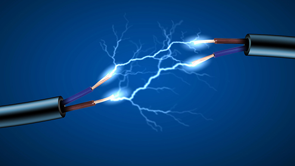

# Electrotecnia
__UNLZ - FI__   
__Alumno:__ Daniel Antonio Lorenzo 

__Descripción:__ prácticas realizadas por mi durante el curso de electrotecnia en la UNLZ - FI.   
Se ofrece libremente, sin garantía.

## índice

### Trabajos prácticos:
* [TP1 - Ejercicios de repaso](https://nbviewer.jupyter.org/github/daniel-lorenzo/Electrotecnia/blob/master/Ejercitacion/Ejercicio_repaso.ipynb)
* [TP2 Conplejos - Impedancia Compleja - Ejercicios de CA -Dominio de la frecuencia](https://nbviewer.jupyter.org/github/daniel-lorenzo/Electrotecnia/blob/master/Ejercitacion/TP2.ipynb)
* [TP3 - Thevenin](https://nbviewer.jupyter.org/github/daniel-lorenzo/Electrotecnia/blob/master/Ejercitacion/TP3.ipynb)
* [TP3 - Ejercicios de entrega](https://nbviewer.jupyter.org/github/daniel-lorenzo/Electrotecnia/blob/master/Ejercitacion/TP3entrega.ipynb)
* [Thevenin](https://nbviewer.jupyter.org/github/daniel-lorenzo/Electrotecnia/blob/master/Ejercitacion/Thevenin.ipynb)
* [TP4 - Potencia - Ejercicios de clase](https://nbviewer.jupyter.org/github/daniel-lorenzo/Electrotecnia/blob/master/Ejercitacion/TP4.ipynb)
* [TP4 - Potencia - Ejercicios de entrega](https://nbviewer.jupyter.org/github/daniel-lorenzo/Electrotecnia/blob/master/Ejercitacion/TP4entrega.ipynb)
* [Modelo de 1er parcial 1](https://nbviewer.jupyter.org/github/daniel-lorenzo/Electrotecnia/blob/master/Ejercitacion/parcial_1modelo.ipynb)
* [Modelo de 1er parcial 2](https://nbviewer.jupyter.org/github/daniel-lorenzo/Electrotecnia/blob/master/Ejercitacion/pm1.ipynb)
* [1er parcial tema A](https://nbviewer.jupyter.org/github/daniel-lorenzo/Electrotecnia/blob/master/Ejercitacion/1parc_temaA.ipynb)
* [TP5 - Circuitos trifásicos](https://nbviewer.jupyter.org/github/daniel-lorenzo/Electrotecnia/blob/master/Ejercitacion/TP5.ipynb)     
* [TP5 - Circuitos trifásicos (Python only)](https://nbviewer.jupyter.org/github/daniel-lorenzo/Electrotecnia/blob/master/Ejercitacion/TP5-2.ipynb)
* [TP5 - Circuitos trifásicos - Ejercicios complementarios](https://nbviewer.jupyter.org/github/daniel-lorenzo/Electrotecnia/blob/master/Ejercitacion/TP5ejcomp-s.ipynb)       
* [Transformador - modelo 2do parcial](https://nbviewer.jupyter.org/github/daniel-lorenzo/Electrotecnia/blob/master/Ejercitacion/Transformador_mp.ipynb)            
* [Transformador - ejercicios para practicar](https://nbviewer.jupyter.org/github/daniel-lorenzo/Electrotecnia/blob/master/Ejercitacion/Transf_ejerc_practica.ipynb)            
* [Transformador monofásico - ejemplo](https://nbviewer.jupyter.org/github/daniel-lorenzo/Electrotecnia/blob/master/Ejercitacion/practica2/trmf.ipynb)           
* [2do_parcial_tema_A](https://nbviewer.jupyter.org/github/daniel-lorenzo/Electrotecnia/blob/master/Ejercitacion/2do_parc_tema_A.ipynb)            

### Ejercicios y ejemplos de libros:
* [Senoides y fasores 1](https://nbviewer.jupyter.org/github/daniel-lorenzo/Electrotecnia/blob/master/Senoides_y_fasores1.ipynb)
* [Senoides y fasores 2](https://nbviewer.jupyter.org/github/daniel-lorenzo/Electrotecnia/blob/master/Senoides_y_fasores2.ipynb)
* [Análisis nodal ca](https://nbviewer.jupyter.org/github/daniel-lorenzo/Electrotecnia/blob/master/Analisis_Nodal_ca.ipynb)
* [Análisis de lazo 1](https://nbviewer.jupyter.org/github/daniel-lorenzo/Electrotecnia/blob/master/Analisis_de_lazo1.ipynb)
* [Análisis de lazo 2](https://nbviewer.jupyter.org/github/daniel-lorenzo/Electrotecnia/blob/master/Analisis_de_lazo2.ipynb)
* [Análisis de lazo 3](https://nbviewer.jupyter.org/github/daniel-lorenzo/Electrotecnia/blob/master/Analisis_de_lazo3.ipynb)
* [Corriente alterna](https://nbviewer.jupyter.org/github/daniel-lorenzo/Electrotecnia/blob/master/Corriente_alterna.ipynb)
* [Potencia compleja](https://nbviewer.jupyter.org/github/daniel-lorenzo/Electrotecnia/blob/master/Potencia_Compleja.ipynb)
* [Análisis de potencia en ca](https://nbviewer.jupyter.org/github/daniel-lorenzo/Electrotecnia/blob/master/Analisis%20de%20potencia%20de%20ca.ipynb)
* [Redes en escalera](https://nbviewer.jupyter.org/github/daniel-lorenzo/Electrotecnia/blob/master/Redes%20en%20escalera.ipynb)
* [Thevenin 1](https://nbviewer.jupyter.org/github/daniel-lorenzo/Electrotecnia/blob/master/Thevenin1.ipynb)
* [Circuitos trifasicos](https://nbviewer.jupyter.org/github/daniel-lorenzo/Electrotecnia/blob/master/Circuitos_trifasicos.ipynb)
* [Potencia trifásico](https://nbviewer.jupyter.org/github/daniel-lorenzo/Electrotecnia/blob/master/Potencia_trifasico.ipynb)
* [Circuitos magnéticamente acoplados](https://nbviewer.jupyter.org/github/daniel-lorenzo/Electrotecnia/blob/master/Circuitos_magneticamente_acoplados.ipynb)   
* [Transformadores ideales](https://nbviewer.jupyter.org/github/daniel-lorenzo/Electrotecnia/blob/master/Transformadores_ideales.ipynb)
* [Transformadores lineales](https://nbviewer.jupyter.org/github/daniel-lorenzo/Electrotecnia/blob/master/Transformadores_lineales.ipynb)
* [Transformadores ejercicios](https://nbviewer.jupyter.org/github/daniel-lorenzo/Electrotecnia/blob/master/Transformadores_ejercicios.ipynb)

## Bibliografía
* Principios de circuitos eléctricos, 3ra. edición. McGraw-Hill - Alexander - Sadiku
* Introducción al análisis de circuitos 12da. edición. Pearson - Boylestad
